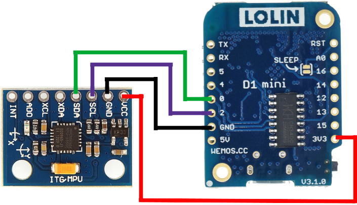

# lolin_d1_mini-mpu6050
Measure angles using mpu6050 on Lolin (Wemos) D1 mini, esp8266

While there are many resources available on the internet for Arduino Uno development boards, I couldn't find any instructions for Wemos D1 mini. I myself struggled to get wemos d1 mini working with MPU6050, so I'm sure this tutorial will be helpful for some folks.

Connection is very straightforward:

Wemos D1 mini |  MPU6050
------------- | ---------
3.3V | VCC
GND | GND
D3 (pin 0) | SDA
D4 (pin 2) | SCL

Like here: 

Make sure to explicitly specify pins 0 (D3) and 2 (D4) to be used for I2C communication inside the code.
>Wire.begin(0,2)

Overview of the code:

* Setup function
    1. Setup I2C connection using Wire Library
    2. Start the timer
    
* Loop function
    1. Calculate the elapsed time since last execution start of loop function
    2. Read raw accelerometer data from mpu6050
    3. Convert the raw accelerometer data to acceleration angles using Euler's formula
    4. Read raw gyroscope data from mpu6050
    5. Convert gyroscope data to degrees/seconds
    6. Calculate the total angle using data from gyroscope and accelerometer

Full tutorial may be found [here](https://bekspace.com/posts/201901/d1-mini-mpu.html)
